## Phase 1 – Azure Network Setup

### Step 1 – Resource Group overview

In this step you create an Azure resource group to hold all of the project resources. The screenshot below shows the overview for the newly created resource group.

[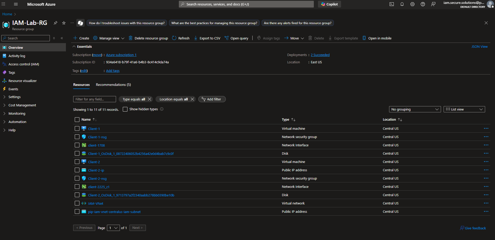](assets/Phase1-Step1_resource-group_overview.png)

### Step 2 – VNet & Subnet configuration

Next, you configure the virtual network and subnet that the machines in this project will use. The image demonstrates the VNet and subnet settings as they were configured.

[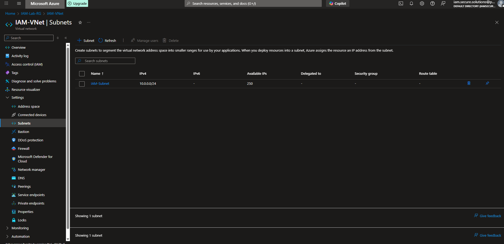](assets/Phase1-Step2.2_vnet_subnet_config.png)

## Phase 2 – Identity Management

### Step 1 – Users created list

During Phase 2 you create a set of test users in Azure AD. Here is the list of users after creation:

[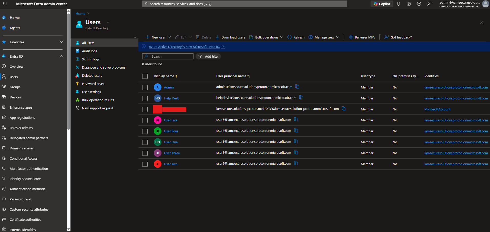](assets/Phase2-Step1_users_created_list.png)

### Step 1B – Reset password

As part of onboarding these users, you reset one of the user passwords. The following screenshot shows the reset‑password dialog in Azure AD.

[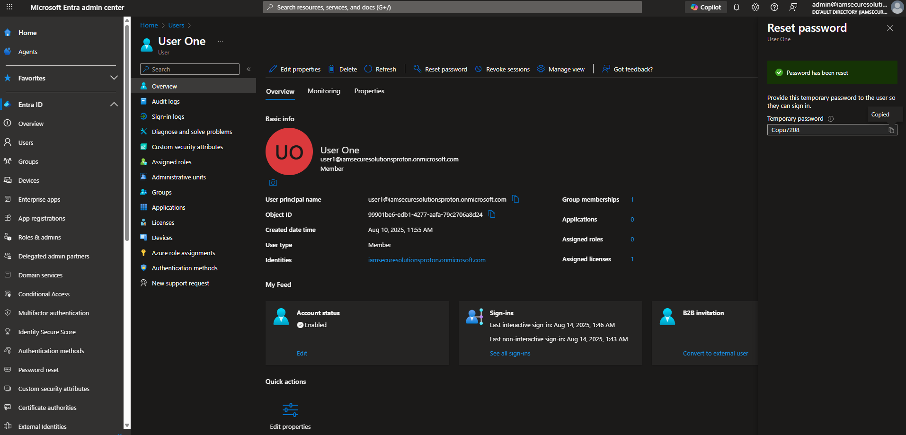](assets/Phase2-Step1B_reset-password.png)

### Step 2 – Group membership

You assign the new users to appropriate groups. Two separate screenshots document the membership lists for the admins and the general users:

[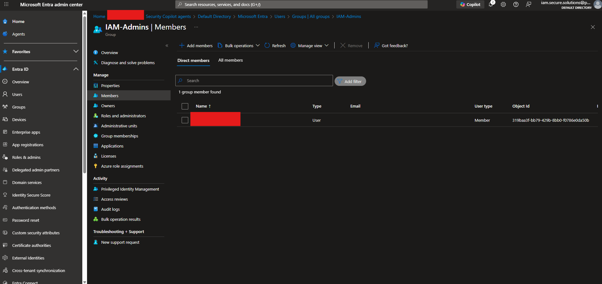](assets/Phase2-Step2_groups_members_admins.png)

[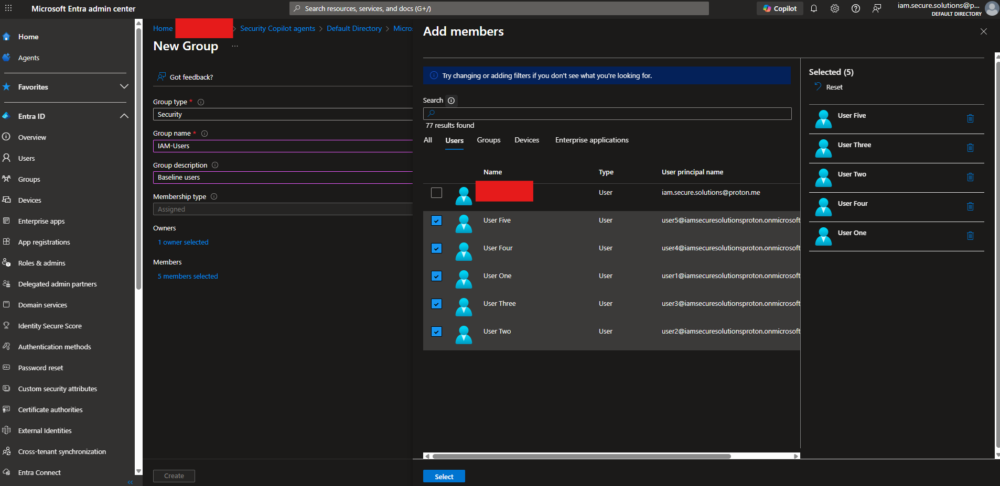](assets/Phase2-Step2_groups_members_users.png)

### Step 3 – Role assignment

In the final step of Phase 2 you assign the **User administrator** role to one of the accounts. The following image confirms that the role assignment was successful:

[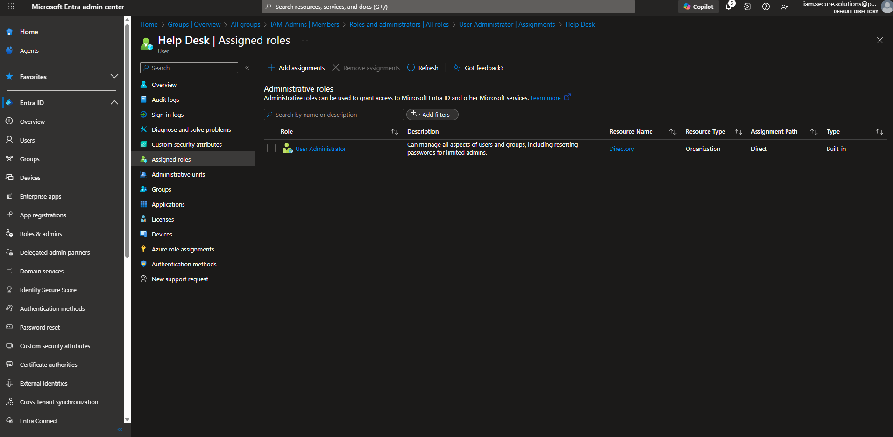](assets/Phase2-Step3_role_useradmin_assigned.png)

## Phase 3 – Device join & Conditional Access

### Step 1 – Device join wizard

After deploying the network and identity setup you join a Windows device to Azure AD. The device join wizard steps through the join process:

[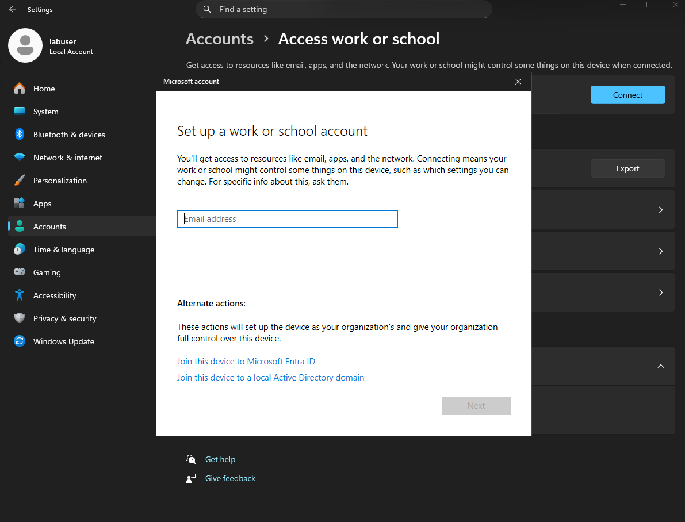](assets/Phase3-Step1_device_join_wizard.png)

### Step 1 – Device list

Once the device is joined, it appears in the Azure AD devices list. The screenshot below shows the list with the newly joined device highlighted:

[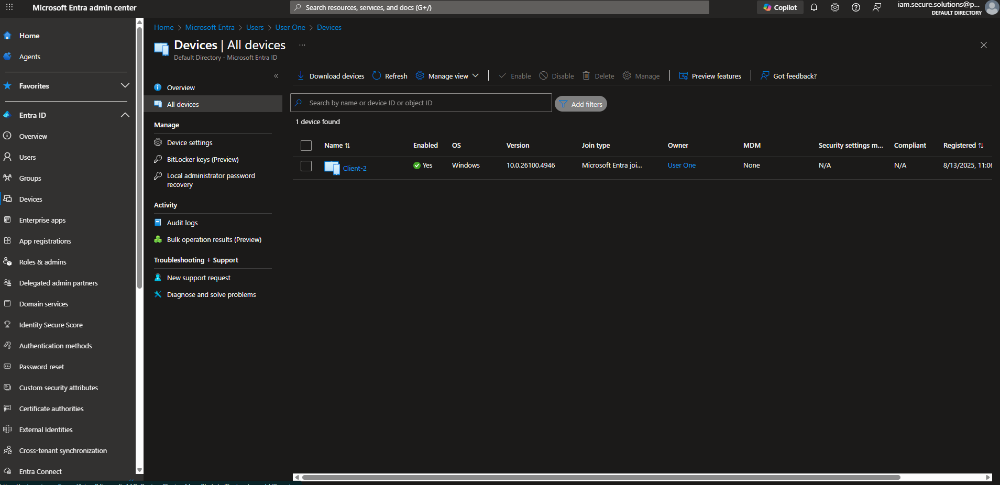](assets/Phase3-Step1_device_list.png)

### Step 1 – `dsregcmd` status

On the joined device you run the `dsregcmd /status` command to verify the hybrid join status. The image captures the command output confirming that the device is Azure AD joined:

### Step 2 – Conditional Access policies

During the final phase you configure conditional‑access policies to protect the environment. Each policy is documented with a separate screenshot.

#### ID Protection dashboard

The ID Protection dashboard provides an overview of risky sign‑ins and users. Here’s what it looked like after enabling risk policies:

[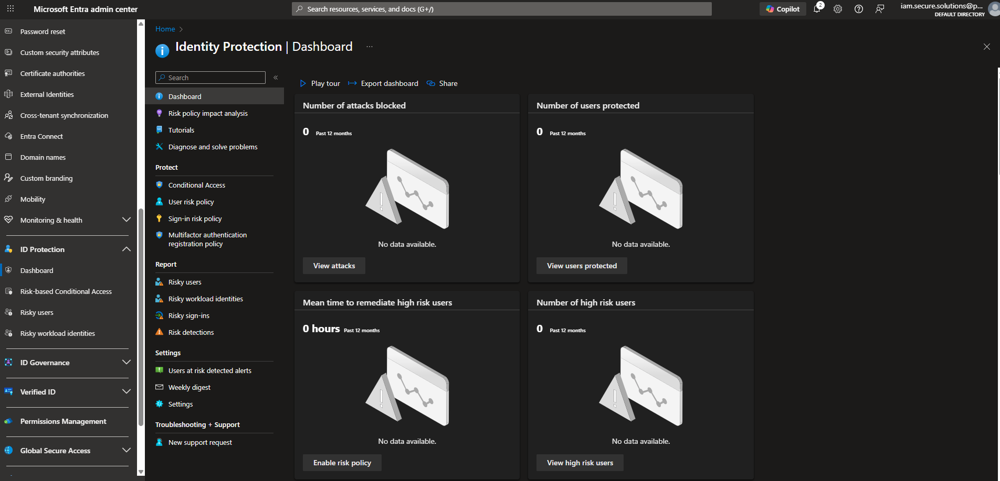](assets/Phase3-Step2_ID-Protection_Dashboard.png)

#### Sign‑in risk policy (On)

This policy enforces additional controls when a high sign‑in risk is detected. The image shows the policy turned on:

[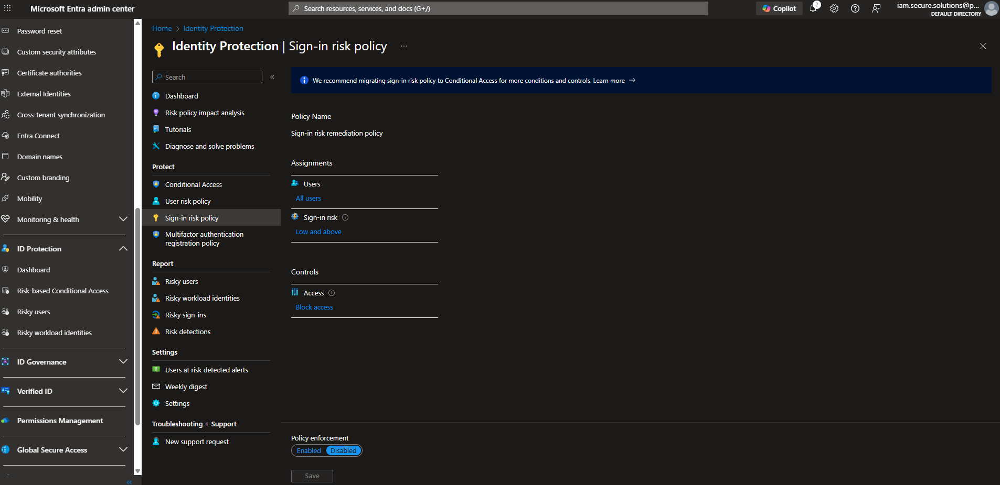](assets/Phase3-Step2_Sign-in-Risk-Policy_On.png)

#### User risk policy (On)

The user risk policy requires multi‑factor authentication for users with an elevated risk. The screenshot confirms that the policy is enabled:

[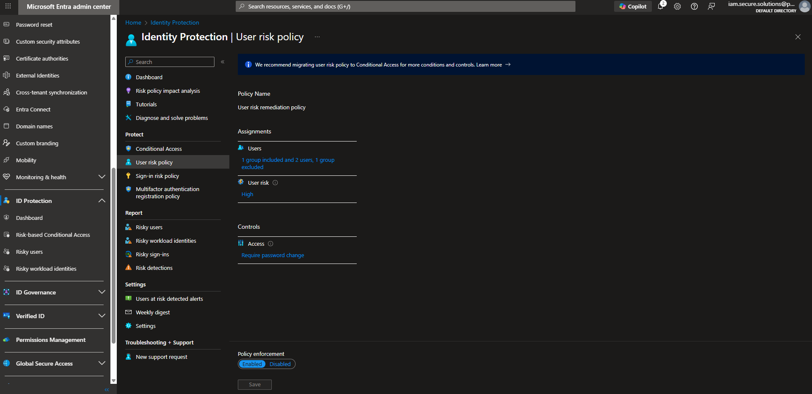](assets/Phase3-Step2_User-Risk-Policy_On.png)

#### Conditional Access policy list

You review the list of Conditional Access policies to verify that all required policies are configured:

[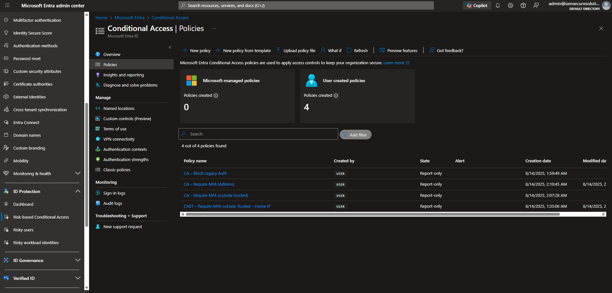](assets/phase03_ca-list.png)

#### Named locations

The **Named locations** blade defines trusted IP ranges and country locations used by Conditional Access. The following screenshot shows the configured named locations:

[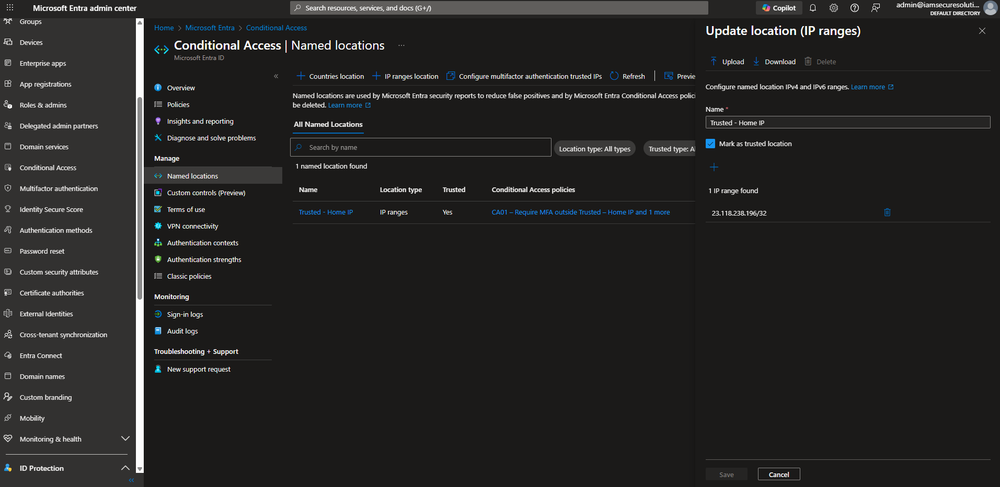](assets/phase03_named-locations.png)

#### CA02: Block legacy authentication

This Conditional Access policy blocks legacy (basic) authentication protocols to improve security:

[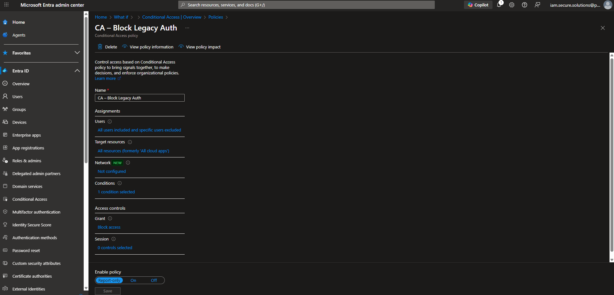](assets/Phase3-Step2_CA02_BlockLegacyAuth.png)

#### CA03: Require MFA for admin roles

Finally, you create a policy that requires multi‑factor authentication for all administrative roles. The screenshot shows the policy configuration:

[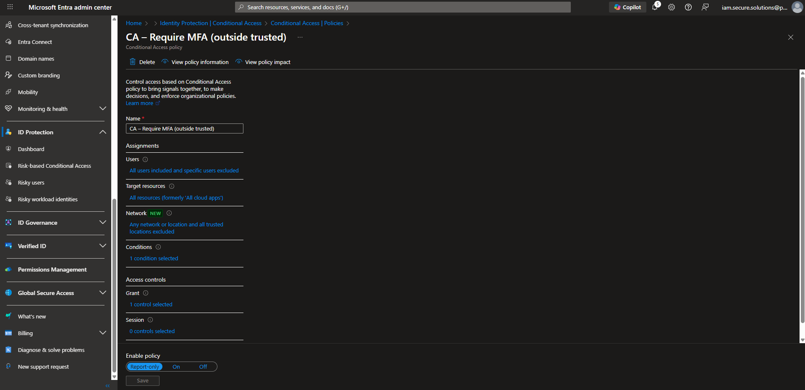](assets/Phase3-Step2_CA03_MFAforAdmins.png)

#### CA – Require MFA for admin roles (everywhere)

In some environments you may need a tenant‑wide policy that enforces multi‑factor authentication for admin roles across all scopes. The screenshot below shows the **Require MFA for admin roles (everywhere)** policy configuration:

[.png)](assets/CA - Require MFA for admin roles (everywhere).png)
